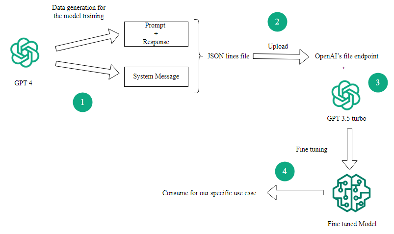

# GPT 3.5 Turbo Fine-Tuning

* Overview:

Process of  fine tuning the GPT 3.5 for our specific use case,can be divided into four main sub-process as below.

Data preparation

Upload files

Creating fine tuning job

Inference from fine tuned model

The following diagram shows how each sub-process links to each other.

  

* Data Preparation:
As a use case,I defined a model to act as a health assistant for the user query.Model response include severity of the illness,cases and treatments for the illness.Initially this all the things should be defined through the prompt.Then  model know how to behave for the user queries.

Once I define the model type,training examples should be generated through the GPT 4.In the data format required for the fine tune the GPT 3.5 contains one single key called “messages”.Under message key,there are two keys called “role” and “content”.Role key define where message came from and content represent content of the message.There are three kind of roles in this data format.
System - Set the behavior of the model
User - Provide message as requests
Assistant - Example of desired behavior

Firstly,I generated data for the user and assistant keys based on my desired behavior.It included 50 examples of user query and responses.Secondly generated a system message relevant to the use case.This will be the same for all the 50 user query and responses.

* Upload files:
For the fine tuning,OpenAI file endpoint require JSON line file format.So,I create a file using generated data in the format of jsonl.Once it was created,the file was uploaded into OpenAI.

* Creating fine tuning job:
To fine tune GPT 3.5,we need to get the “file id” for the uploaded  data from OpenAI.Using “file id” and “openai.FineTuningJob.create” function we can start the fine tuning process.

* Inference from fine tuned model:
After the fine tuning process was completed,I grabbed the model id from the “fine_tuned_model” field to use as model identifier.Now using this model id,it is possible to get responses for user queries.

To test the model performance,I gave the following query as input to the fine tuned model and got the response as below.

Query : Tell me about Influenza ?

Response : Influenza, commonly known as the flu, is a contagious respiratory illness caused by influenza viruses. It can cause mild to severe illness, and at times can lead to death. The severity can vary depending on the individual and the virus strain. Symptoms often include fever, cough, sore throat, muscle aches, fatigue, and runny or stuffy nose. The best way to prevent influenza is vaccination. Treatment usually involves rest, fluids, and over-the-counter medicines to reduce symptoms. In some cases, antiviral drugs may be prescribed to help lessen the severity and duration of the illness. It's important to contact a healthcare professional for an accurate diagnosis and guidance on treatment. Please consult a doctor if you're experiencing symptoms or have any concerns.
